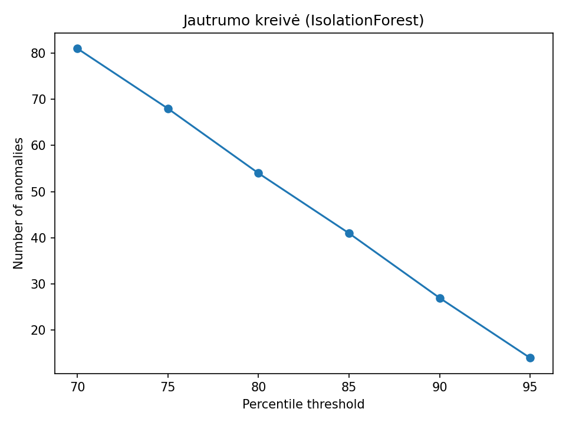

# MB-Ailena-Anomaly-Detection
### Anomalijų skaičius (@85th)

## Ataskaitos lentelės

- [Modelių santrauka](report/model_summary.md)
- [AE – TOP 10](report/ae_top10.md)
- [Isolation Forest – TOP 10](report/ifor_top10.md)
- [OCSVM – TOP 10](report/ocsvm_top10.md)
- [LOF – TOP 10](report/lof_top10.md)

## Slengsčio jautrumas

## Išvados (trumpai)
- Pritaikyti 4 anomalijų aptikimo modeliai: Autoencoder (MSE), Isolation Forest, OCSVM, LOF.
- Duomenys – mėnesiniai pardavimai per prekių grupes (2025 m., stulpeliai: Mėnuo, Kiekis, Pirkimo/Pardavimo suma EUR, Pelno stulpelis).
- Naudotas slenkstis: 85-asis procentilis pagal rekonstrukcijos/”score” reikšmes.
- Modelių aptiktų anomalijų kiekiai – panašūs (vizualizacija README viršuje).
- Daugiausiai anomalijų kartojasi šiose prekių grupėse: *(įrašyk pagal TOP lenteles)*.
- Verslui: anomalijos dažniausiai sutampa su staigiais nuokrypiais (kiekiai/įplaukos/pelnas). Rekomenduota automatinė tikrintina sąrašų peržiūra kas mėnesį.
- Pilnos išvados ir TOP-10 lentelės – [čia](report/Isvados.md).
- Repo (landing): https://github.com/GiedriusDapsys/MB-Ailena-Anomaly-Detection

Ataskaita (Report.md): https://github.com/GiedriusDapsys/MB-Ailena-Anomaly-Detection/blob/main/report/Report.md

Colab (notebook): https://colab.research.google.com/github/GiedriusDapsys/MB-Ailena-Anomaly-Detection/blob/main/notebooks/MB%20Ailena%20Anomaly%20Detection%20Report.ipynb
